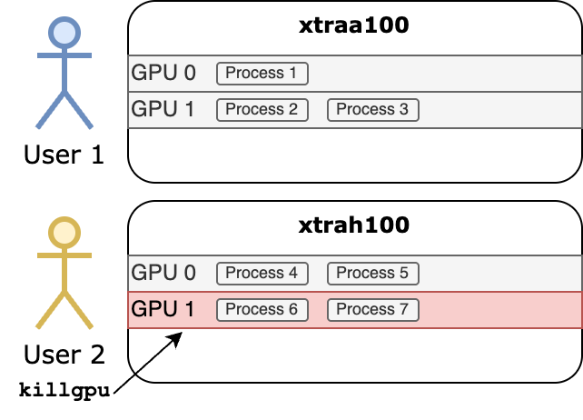

# Terms of Use - Xtra Computing Server

**Introduction**
The Xtra Computing Server provides computational resources (GPU, CPU, memory, and storage) primarily to support research and academic activities. Users must follow the guidelines outlined in this document to ensure fair resource allocation and maintain a productive computing environment.

> [!NOTE]  
> Resources are intended for the use of Xtra Computing Group only.
> 
> Any misuse may result in the termination of your computing tasks.

## Account

### Creation

Users must apply via the provided registration form: https://forms.gle/Wf8qbNeuSPS2ia8u6

### Account Management

| Event              | Action                 | Notes                                                    |
|--------------------|------------------------|----------------------------------------------------------|
| Account Expiration | Account Frozen         | You cannot log in. Contact admin within 6 months to unfreeze. |
| 6 months post-expiration | Account Removal | Data preserved temporarily in cold-storage[^1]; integrity not guaranteed. |
| 12 months post-expiration | Data Deletion | Files permanently deleted; recovery impossible.         |

[^1]: Cold storage refers to a type of data storage designed for infrequently accessed data. Since moving data in and out of cold storage takes a long time, it is mainly used for archiving or backup purposes rather than for data that needs to be accessed frequently.

All notifications and alerts are communicated exclusively via your registered email address.

**Unfreezing Your Account**
To request reactivation after account freezing, contact the administrator. Reactivation requests are typically processed within 1-2 business days.

---

## Disk

### **Disk Space Allocation**

| User Category          | `home` Disk Quota |
|------------------------|-----------------|
| PhD Students           | 512 GiB         |
| Others | 256 GiB         |

Additional disk space requests are possible via email to the administrator and are considered based on project justification and resource availability.

For hosting large datasets, please contact the administrator. Dataset hosting will not count against your quota.

### **Data Integrity**

Data integrity is **not** guaranteed. Users must perform regular backups. Weekly backups are recommended, with more frequent backups suggested for critical data. For critical data requiring higher reliability, use the `/shared/hdd` or `/shared/ssd` directory protected by RAIDZ2 (resilient to two drive failures).

### **Privacy**

By using the servers, users consent to file reviews by administrators to ensure compliance. Reviews typically occur in response to specific incidents, abnormal resource usage, or during security audits. We never do routine or random inspections for no reason.

**Do not** store private or sensitive files (e.g., personal photos, videos, confidential documents).

### **Disk Usage Accounting**

Disk usage is tracked monthly (GB/month) across all servers, attributed uniquely per user. High usage users may be contacted to reduce disk usage. 

---

## GPU

### Default Quota

We aim to ensure that all users have equal and convenient access to GPU resources. Our system is designed to be as unrestricted as possible while maintaining fairness among users.

| User Category          | GPUs Allowed Without Application |
|------------------------|----------------------------------|
| all_user           | 2 GPUs freely                    |

Users can utilize GPUs freely within their quota and may also exceed their quota when additional GPUs are available and not in use by others.

If you have compute-intensive tasks, please consider using the [HACC Cluster](https://xacchead.d2.comp.nus.edu.sg/) or the [SoC Cluster](https://dochub.comp.nus.edu.sg/cf/guides/compute-cluster/access), which are better suited for high-performance computing needs.

### Extra GPU Usage

**You can use more than 2 GPUs without application.** However, other users may terminate your extra usage processes using the command `killgpu`. Users whose processes are terminated will **not** be notified.

The killing unit is the **GPU**. Processes running on GPUs with higher indices will be killed first. All processes belonging to the same user on the targeted GPU will be terminated.

**Example:**

- `User 1` is using `xtraa100` (process 1,2,3) and `xtrah100` (process 4,5,6,7)
- `User 2` wants to use `xtrah100` and use command `killgpu`.
- The `Process 6` and `Process 7` belongs to `User 1` will be terminated. (GPU 1 has higher indices than GPU 2)

### Reserve GPUs  

To reserve GPUs, please fill out the reservation form: [Reservation Form](https://forms.gle/6W1CxQAojMANpx1FA).

Reserved GPUs **will not** be terminated by the `killgpu` command.

---

## CPU & Memory

Currently, we do not limit the CPU and memory usage of our users. However, excessive CPU or memory usage negatively impacting others, may result in penalties.

Excessive usage is determined based on its impact on system stability

- Out-of-memory (OOM) errors that prevent other users from accessing the server (e.g., making it impossible to SSH in).
- Any behavior that requires administrator intervention to restore normal operations.

| Offense Times | Action                                |
|---------------|---------------------------------------|
| 1st           | Notification                          |
| 2nd           | Warning                               |
| 3rd           | Account frozen for 2 day              |
| 4th           | Account frozen for 2 weeks            |
| 5th           | Permanent ban from all infrastructures|

---

### General Disclaimer

Xtra Computing Server administrators and affiliates are not responsible for data loss, damages, or inconveniences arising from hardware failures, software issues, or user actions. Users assume full responsibility for data backups and accept resources as-is without warranty.

